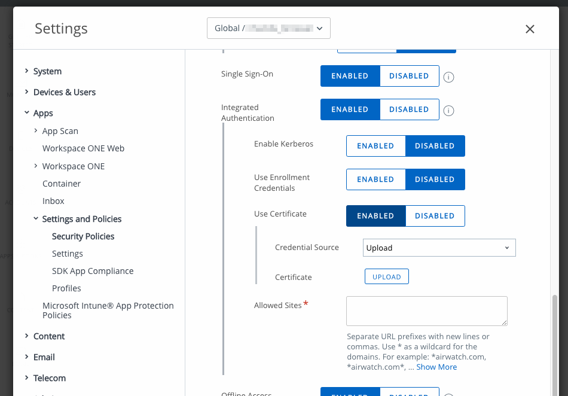
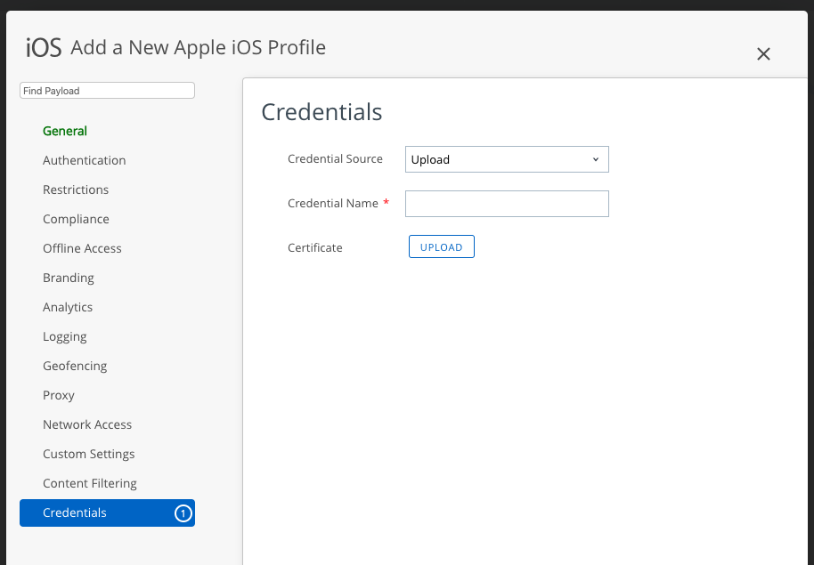

# Identity Certificate Export
VMware Workspace ONE® integrated authentication supports end user identification
by electronic certificate. If that feature is in use, identity certificates will
be stored by Workspace ONE on end user mobile devices. Stored certificates can
be exported by mobile applications that have integrated the Workspace ONE mobile
software development kit.

Integrated authentication is configured in the Workspace ONE Unified Endpoint
Manager (UEM) console. Identity certificate storage and export is handled by the
Workspace ONE mobile Software Development Kit (SDK). Identity certificate export
is available in the SDK for iOS.

# Table of Contents
{{TOC}}

# Description
The integrated authentication feature of the Workspace ONE platform supports end
user identification by electronic certificate. Integrated authentication is
configured in the enterprise UEM and applies to its enrolled end users,
according to organization group and SDK profile. Depending on the configuration
that applies to a particular end user, one or more identity certificates could
be stored on their mobile device.

In an application that has integrated the Workspace ONE mobile SDK, stored
identity certificates will be used by the SDK to respond to applicable
authentication challenges. The SDK also supports certificate export, in case
there is a requirement for other uses of identity certificates.

The SDK will make use of a secure store on the device to protect certificates
that it handles. It is intended that an application that exports stored
certificates from the SDK immediately imports the certificates into a suitable
secure store, such as the iOS keychain.

# Integration
To integrate identity certificate export into your application, follow the
instructions below.

## Compatibility
Before you begin integration, ensure you have access to compatible versions of
software. The following table shows the version numbers of the Workspace ONE
components in which this feature first became available.

Software                         | Available
---------------------------------|----------
Workspace ONE SDK for iOS        | 20.2
Workspace ONE management console | 9.7*

Version 9.7* is the earliest supported UEM at time of writing. All current
versions of UEM support integrated authentication and identity certificates.

## Configuration
An integrated authentication configuration that will give exportable identity
certificates can be set up in the Workspace ONE management console. The
following instructions are intended for application developers or other users
wishing to try out certificate export. Full documentation can be found in the
online help.

You will need a suitable certification authority (CA) certificate. Typical
formats are .pfx and .p12 files. You can find instructions online for creating a
CA for self-signing.

The configuration can be set up as the default for a UEM organization group, or
as a custom SDK profile.

### Configure as Default
To configure as the default:

1.  Log in to the management console.

    The dashboard will be displayed.

2.  Select an organization group.

    By default, the Global group is selected.

3.  Navigate to: Groups & Settings, All Settings, Apps, Settings and Policies,
    Security Policies.

    This opens the Security Policies configuration screen, on which a number of
    settings can be switched on and off, and configured.

4.  For the Integrated Authentication setting, select Enabled.

    When Enabled is selected, further controls will be displayed.

5.  Make the following selections:

    -   Use Certificate: Enabled.
    -   Credential Source: Upload.

    Select the option to Upload.

6.  Upload your CA certificate.

7.  Select Save to commit your changes to the configuration.

### Configure as Custom Profile
To configure as a custom profile:

1.  Log in to the management console.

    The dashboard will be displayed.

2.  Select an organization group.

    By default, the Global group is selected.

3.  Navigate to: Groups & Settings, All Settings, Apps, Settings and Policies,
    Profiles.

    This opens the Profiles list.

4.  Either add a new profile, or edit an existing profile, as follows.

    -   To create a new profile, select Add Profile, then SDK Profile, then iOS
        Apple profile. Enter a name for your new profile.
    
    -   To edit an existing profile, click its label in the list. It must be an
        iOS Apple profile.
    
    In either case, a profile editing screen will be displayed.

5.  Select Credentials and then Configure, then select to Upload.

6.  Upload your CA certificate.

7.  Select Save to commit your changes to the configuration.

See also the console user interface screen captures in the appendix to this
document.

## Programming Interface for Swift
The certificate export programming interface for Swift is asynchronous. The
application code requests the export and specifies a callback. The SDK then
invokes the callback with the exported certificates as a parameter.

### Code Snippets
The following code snippet illustrates the **request** programming interface.

    let controller = AWController.clientInstance()
    controller.exportIdentityCertificates { (certificateMap, nsError) in
        if nsError == nil {
            for (key, certificates) in certificateMap! {
                handle(certificates:certificates, usedFor:key)
            }
        }
        else {
            // Handle the error, represented by an NSError.
        }
    }

The request programming interface is in the AWController singleton object; call
the exportIdentityCertificates method. Its parameter is a callback that receives
a dictionary and an NSError, either of which can be nil. The dictionary is a
mapping in which each key is a String and each value is an Array of exported
certificates, see next snippet.

The following code snippet illustrates the **exported certificate** programming
interface.

    func handle(
        certificates: [PKCS12Certificate],
        usedFor usageKey: String
    ) {

    // Code to determine onward processing goes here. Check usageKey against these values:
    //
    // -   CertificateUsageKey.integratedAuthIdentity
    // -   CertificateUsageKey.uncategorizedIdentity
    //
    // Following assumes that all certificates will be imported into a secure store.

        for certificate in certificates {

    // Code to import one certificate into the secure store goes here, for example a call to the
    // SecItemImport function.
    //
    // In each iteration, certificate has these properties:
    //
    // -   certificate.data: Data  
    //     Suitable for the SecItemImport importedData argument.
    //      
    // -   certificate.importExportPassphrase: String  
    //     Suitable as a SecItemImportExportKeyParameters passphrase value, in the SecItemImport
    //     keyParams argument.

        }
    }

Exported certificates are represented by instances of the Workspace ONE
PKCS12Certificate class. Each instance has two properties, `data` holding the
encrypted certificate, and `importExportPassphrase` holding the passphrase for
the decryption.

See also the SecItemImport reference documentation, on the Apple developer
website here:  
[https://developer.apple.com/documentation/security/1395728-secitemimport](https://developer.apple.com/documentation/security/1395728-secitemimport)

### Notes
The following notes apply to the programming interface, above.

-   The request callback won't be invoked on the main thread.

-   The import-export passphrase values in the programming interface are
    transient.

-   Either of the parameters passed to the request callback can be nil, and the
    map can be empty, as follows.

    -   If the SDK somehow fails to export certificates, the map will be nil and
        the error won't be nil.
    -   If identity certificates aren't available for the current end user, due
        to the enterprise settings and configuration, the error will be nil and
        the map will be empty.
    -   Expired or otherwise invalid certificates won't be returned in the map.
        If no stored certificates are valid, then the map will be empty. The
        error won't be nil in either case.

-   The UEM administrator can change the integrated authentication configuration
    at any time. If use of identity certificates is stopped, the next time
    export is requested, the returned map will be empty.

-   The SDK will in general handle renewal of certificates. If the application
    code determines that a certificate will expire, a fresh export should be
    requested using the same programming interface as above. The same applies in
    the case that an exported certificate is rejected.

# Appendix: Console User Interface
The following screen captures shows this feature's configuration in the
management console.

# Document Information
## Revision History
Date     | Revision
---------|------------------
31mar2020| First Publication.

## Legal
-   **VMware, Inc.** 3401 Hillview Avenue Palo Alto CA 94304 USA
    Tel 877-486-9273 Fax 650-427-5001 www.vmware.com
-   Copyright © 2020 VMware, Inc. All rights reserved.
-   This product is protected by U.S. and international
    copyright and intellectual property laws. VMware products are covered by one
    or more patents listed at
    [https://www.vmware.com/go/patents](https://www.vmware.com/go/patents).
    VMware is a registered trademark or trademark of VMware, Inc. and its
    subsidiaries in the United States and other jurisdictions. All other marks
    and names mentioned herein may be trademarks of their respective companies.
